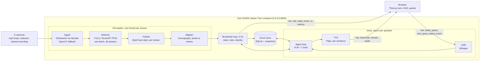
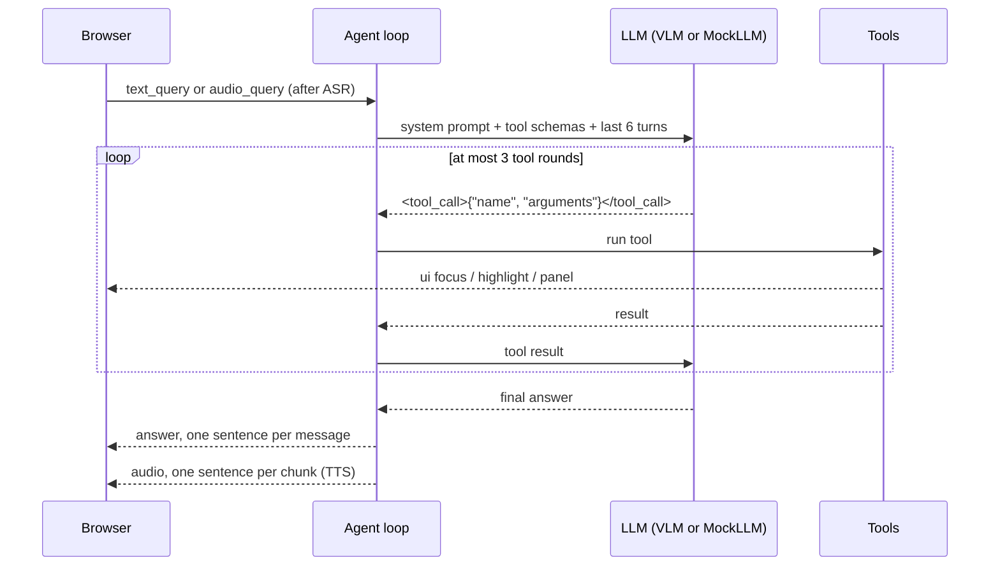

# Technical architecture

How Talk-to-your-Company is built. `specs/spec.md` says what the product does, `specs/plan.md` is the
working plan; this document is the same design told as one picture, for a reader who has not seen the
code. Where this document and the plan differ, the plan wins.

Status: everything below runs on a laptop (mock mode, and the real backends on a CPU with small
models). Nothing has run on a Jetson Thor yet; the Jetson figures are design targets from
`specs/plan.md` section 8 and are marked as such.

## 1. System in one picture

One FastAPI process on one device. The browser is the only client, and port 8000 is the only port.



Three things run at once inside the process:

| Loop | Rate | Work |
|---|---|---|
| Perception threads | per frame, target 10 fps per stream | decode, detect (one batch for all streams), track, map to floor metres |
| Broadcast loop | 5 Hz (metrics at 1 Hz) | read the latest tracks, run the rules, attach identity, store events, send `state`, `event`, `metrics` |
| Agent loop | per question, async | speech to text, tool calls, final answer, sentence-by-sentence speech |

## 2. Repository layout

```
app/main.py         FastAPI app, static files, /ws, broadcast loop, camera endpoints
app/config.py       loads config/site.yaml and the run modes from the environment
app/protocol.py     pydantic models for every WebSocket message
app/backends.py     builds the four heavy components, falls back to mocks
app/perception/     base, ingest, detector, tracker, mapper, pipeline, mock
app/events/         rules.py (pure functions), store.py (SQLite)
app/agent/          llm.py (mock + local), tools.py, loop.py, prompts.py
app/voice/          asr.py, tts.py (mock + local each)
app/identity.py     synthetic employee directory, simulated badge feed, zone visit timing
app/metrics.py      fps, voice latency, GPU, memory
web/                index.html, style.css, src/*.js (plain ES modules), vendor/three
config/             site.yaml (the site), employees.yaml (synthetic people)
scripts/            setup_jetson.sh, preflight.sh, run.sh, safe_install.sh, download_models.py,
                    get_sample_videos.py, calibrate.py, eval_tool_calling.py
tests/              pytest, mock mode only, no GPU
specs/              spec.md, plan.md, tasks.md
```

## 3. Site model: one file drives everything

`config/site.yaml` is the only place that knows plants, floors, cameras, zones and equipment. The twin,
the rules and the agent all read it; nothing about the layout is in code.

```yaml
plants:
  - id: P1
    name: Plant 1
    floors:
      - id: F1
        size_m: [40, 25]                      # floor footprint in metres
        camera: {id: cam_p1f1, video: p1f1.mp4, homography: [[..],[..],[..]]}
        zones:
          - {id: z1, type: restricted, polygon: [[0,0],[5,0],[5,5],[0,5]]}
        objects:
          - {id: c1, type: conveyor, rect: [8, 11, 20, 1.6]}   # x, y, width, depth
```

- A floor's global key is `P1/F1`.
- Zone types: `restricted`, `walkway`, `dock`. Object types: `conveyor`, `rack`, `machine`, `pallets`, `office`.
- `camera.video` is an mp4 file (looped, looked up in `VIDEOS_DIR`), `browser` (frames come from a
  browser's webcam) or `webcam:<device>` (a camera on the machine).

## 4. Perception pipeline

| Stage | Module | What it does |
|---|---|---|
| Ingest | `perception/ingest.py` | One class per source kind, all with the same `latest()` interface. Files use GStreamer `filesrc ! qtdemux ! h264parse ! nvv4l2decoder ! nvvidconv ! appsink`, looping and throttled to real time at 1280x720, with OpenCV `VideoCapture` as the fallback. |
| Detect | `perception/detector.py` | YOLO exported to TensorRT FP16, the latest frame of every stream in one batch. COCO has no forklift class, so `truck` maps to forklift and `car`, `bus`, `motorcycle` to vehicle; weights with a real `forklift` class work unchanged. |
| Track | `perception/tracker.py` | ByteTrack-style two-stage IoU association per stream, in pure Python, without a Kalman filter. Gives stable ids. |
| Map | `perception/mapper.py` | The foot point (bottom centre of the box) goes through the camera homography to floor metres. `scripts/calibrate.py` fills the homography from four clicked points. |
| Mock | `perception/mock.py` | Simulated people and vehicles walk between waypoints around the equipment; every 30 s a scripted scenario steers them so that the real rules raise a real event. |

Camera view: `GET /api/camera/{plant}/{floor}` returns the floor's current frame as a JPEG with every
track boxed. The browser polls it about four times a second for the focused floor only, so one stream
is encoded at a time.

Shared sources: `POST /api/camera/{plant}/{floor}/frame` accepts one JPEG frame from the browser
(webcam, or a video file played in the page). While shared frames are fresh they replace that
camera's own picture; a frame older than 2 s counts as no picture.

## 5. Rules and events

Rules are pure functions over the tracks of one floor, unit-tested, and run in the broadcast loop on
whichever perception backend is active.

| Event | Raised when | Notes |
|---|---|---|
| `near_miss` | a person and a forklift are within 2 m and closing faster than 0.5 m/s | |
| `restricted_zone` | a person is inside a restricted polygon for more than 2 s | once per stay; a person authorised for the zone raises nothing |
| `crowding` | more than 4 people are within a 3 m radius | |
| `no_helmet` | the vision model answers "no" about a person crop | one unchecked person every 3 s, skipped while the model is answering the user |

Debounce: a rule does not fire again on a floor within 30 s for any of the same tracks.

Each event is one row in SQLite (`DATA_DIR/events.db`), with a snapshot file in `DATA_DIR/snapshots`:

| Column | Type | Meaning |
|---|---|---|
| `id` | integer, primary key | event id, used by "that" in conversation |
| `ts` | real, indexed | when it was raised |
| `plant`, `floor`, `camera_id` | text | where |
| `type` | text | one of the four event types |
| `severity` | integer 1-3 | |
| `track_ids` | JSON text | the tracks involved |
| `x`, `y` | real | position on the floor, in metres |
| `snapshot_path` | text | URL path of the camera snapshot |
| `summary` | text | one line, names the person when one person is involved |
| `person_id` | text, nullable | employee id from the badge feed |

An event is "open" for 10 minutes after it is raised. Events can be queried by plant, floor, type and
time range.

## 6. WebSocket protocol

One socket at `/ws`, JSON, every message a pydantic model in `app/protocol.py`; the field `type`
discriminates. On connect the server sends `site`, the current `state`, then one `event` per event of
the last 10 minutes.

| Direction | Message | Payload | When |
|---|---|---|---|
| server to client | `site` | the whole site config | on connect |
| | `state` | `{ts, zones: {"P1/F1": [{id, cls, x, y}]}}` | 5 times a second |
| | `event` | one event row | when a rule fires |
| | `ui` | `{action: focus, highlight or panel, plant, floor, event_ids, content}` | when a tool moves the twin |
| | `transcript` | `{text, final}` | for spoken and typed questions |
| | `answer` | `{text, done}` | one sentence per message |
| | `audio` | `{seq, wav_b64, last}` | sentence `seq` spoken |
| | `metrics` | `{fps, voice_latency_ms, gpu_pct, mem_gb}` | once a second |
| client to server | `audio_query` | `{wav_b64}` 16 kHz mono 16-bit WAV | on push-to-talk release |
| | `text_query` | `{text}` up to 500 characters | from the text box |
| | `select_event` | `{event_id}` | on a marker click |

HTTP besides the socket: `GET /api/health` (the run modes actually in use), the two camera endpoints
above, `/snapshots/` and the static frontend.

## 7. Agent



- Tool calling is JSON-constrained: the tool schemas go into the system prompt and the model answers
  `<tool_call>{"name", "arguments"}</tool_call>`, parsed by the app. This does not depend on a model's
  chat template.
- The system prompt rules: two sentences or fewer, always call a tool before stating a fact about the
  site, say "I can't see that" when tools return nothing, never name a person from appearance.
- The prompt ends with `Current view:` and `Last event id:` so "that" and "there" resolve.
- `MockLLM` is a keyword router that calls the same tools. It is the laptop backend and the fallback.

| Tool | Returns | Effect on the twin |
|---|---|---|
| `query_events(plant?, floor?, type?, minutes_back=10)` | events, newest first | highlights their markers |
| `live_state(plant?, floor?)` | people, vehicles and open events per floor and plant | |
| `look(plant, floor, question)` | the vision model's answer about the current frame | focuses that floor |
| `focus_view(plant, floor?)` | | flies the camera there |
| `show_event(event_id)` | | opens the event panel, highlights the marker |
| `identify_person(event_id?, name?)` | employee details, visit timing, location, incidents in 24 h | opens the person panel |
| `write_report(event_id)` | what, where, when, who, severity, action | opens the report panel |

`write_report` is filled from the event row, not generated, so a report cannot contain invented facts.

## 8. Voice

1. The browser records with `MediaRecorder` while the button or the space bar is held, converts to
   16 kHz mono 16-bit WAV and sends `audio_query`.
2. Whisper transcribes it; the transcript goes back as `transcript`.
3. The agent loop produces the answer; it is split into sentences.
4. Piper synthesises each sentence; each goes out as an `audio` chunk and is played from a queue.

Target: 2.5 s from release to first spoken audio, hard limit 5 s. Measured so far: 3.8 s on a laptop
CPU with the mock LLM; unmeasured on the Jetson. If the target is missed, streaming the generation
token by token is the first thing to add.

## 9. Identity (synthetic data only)

- `config/employees.yaml` is a fictional directory: id, name, role, department, shift, supervisor,
  home floor, authorised zones, certifications.
- `BadgeFeed` in `app/identity.py` stands in for an access-control system. It gives each tracked
  person on a floor one of that floor's employees and keeps the badge when the tracker loses and
  re-finds someone nearby. It is the single place to replace with a real badge or location system.
- Nobody is identified from their face or appearance. With real footage the badge is attached to
  whoever the tracker sees on that floor: it shows the flow, it does not know who is in the video.
- Visit timing (entered, alert raised, left, time in zone) is kept in memory per event.

## 10. Frontend

Plain ES modules, Three.js r170 vendored in `web/vendor/`, no bundler, no framework.

| Module | Role |
|---|---|
| `main.js`, `ws.js` | start-up, the WebSocket, message dispatch |
| `scene.js` | renderer, lights, orbit controls, camera tween helper |
| `twin.js` | builds plants and floors from the `site` message; explode and focus animations |
| `fixtures.js` | equipment as instanced boxes, 5 m grid, see-through walls, zone outlines |
| `tracks.js` | instanced meshes per class, positions interpolated between `state` messages |
| `events.js` | pulsing markers, click picking, the side panel |
| `camera.js` | camera view of the focused floor; share webcam, share recording |
| `voice.js`, `wave.js` | push-to-talk, queued audio playback, the waveform |
| `hud.js` | per-stream fps, voice latency, GPU, memory, "No audio or video leaves this device" |

## 11. Run modes and fallback

Every heavy component has a mock, chosen by an environment variable:

| Variable | Real | Mock |
|---|---|---|
| `PERCEPTION=real` | video, detector, tracker, mapper | simulated people and vehicles, scripted scenarios |
| `LLM=local` | vision-language model | keyword router calling the same tools |
| `ASR=local` | Whisper | a fixed question (`MOCK_ASR_TEXT`) |
| `TTS=local` | Piper | a short chime per sentence |

If a real backend fails to load, `app/backends.py` logs it and starts that backend's mock, so the app
always starts. `GET /api/health` shows what is actually running.

## 12. Deployment on the Jetson Thor (design, not yet run)

Constraints of the target machine: no sudo, no apt, no Docker, only `pip install --user`; never
install, upgrade or pin `torch`, `torchvision` or `numpy`; code in `/workspace`, models and data in
`/cache`; 8 CPU cores, 15 GB RAM, one GPU shared with other teams; only port 8000 is published.

| Script | When | What it does |
|---|---|---|
| `scripts/setup_jetson.sh` | once, needs the network | records the torch, torchvision and numpy versions; installs each package through `safe_install.sh` (which refuses anything whose dry run would touch those three) and stops if the versions changed; downloads the models; exports the detector to TensorRT; fetches the sample videos; runs preflight |
| `scripts/calibrate.py` | once per camera | four clicked image points and their floor coordinates give the homography |
| `scripts/preflight.sh` | every start | CUDA available, hardware decoder present, 5 GB free in `/cache`, port 8000 free, Python modules, detector engine, vision-language model, Whisper, Piper voice, every video |
| `scripts/run.sh` | every start | sets all four modes to real, data in `/cache/ttyc`, the Hugging Face and Ultralytics offline flags, then starts uvicorn on `0.0.0.0:8000` |

Memory budget (planned, to be measured on the device):

| Component | Candidate | Budget |
|---|---|---|
| Vision-language model (agent and `look`) | 3B class, half precision (default `Qwen2.5-VL-3B-Instruct`) | 6 GB |
| Speech recognition | Whisper small | 1.5 GB |
| Detector | YOLO, TensorRT FP16 | 1 GB |
| Speech synthesis | Piper, on the CPU | 0.3 GB |
| App, frames, buffers | | 2 GB |
| Headroom | | 2 GB or more |

One vision-language model serves both the conversation and the `look` tool, to stay in budget.

## 13. Testing

- `pytest -q`: 77 tests, mock mode only, no GPU. Unit tests for the config loader, the protocol
  models, each rule, the event store, each tool and the identity code; integration tests that connect
  to `/ws` and ask the golden-path questions.
- `scripts/eval_tool_calling.py`: 15 questions with the expected tool; the local model must get 13.
- On the Jetson: `scripts/preflight.sh`, then the golden path from `specs/spec.md` section 8, three
  clean runs.

## 14. Risks

| Risk | Mitigation |
|---|---|
| The shared GPU slows everything | keep the detector at 10 fps, pre-warm the models, record a backup video |
| A dependency replaces torch | dry-run check before every install |
| A small model is weak at tool calling | JSON-constrained tool calls; `MockLLM` as the fallback for navigation |
| The microphone is blocked in the browser | the text box does the same thing |
| A model fails to load on stage | that backend starts as its mock |
